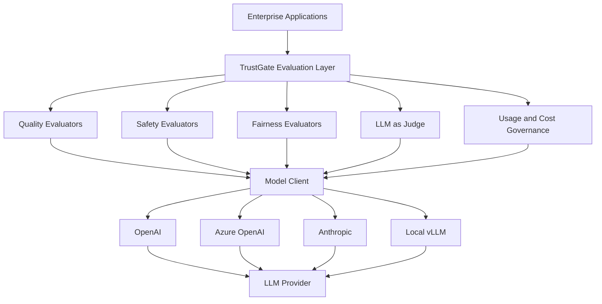

# 🧭 TrustGate Evaluation Platform  
**Enterprise AI Quality, Safety, Fairness, and Cost Governance**

TrustGate is a **unified evaluation and governance layer** for enterprise AI systems.  
It ensures every model output — across LLMs, STT, intent classification, and structured reasoning — is **measured, audited, and governed** before reaching production.

Unlike typical model-eval code, TrustGate is designed as a **scalable governance platform** used by:

- Engineering  
- Data Science  
- Compliance & Legal  
- Security  
- Product & Delivery  
- Finance / Cost Governance  

This README presents the **strategic, enterprise-level framing** expected from a Director/Head of AI Governance.

---

# 🚀 Why TrustGate Matters (Executive Summary)

Enterprises adopting generative AI face four risks:

1. **Quality risk** (hallucinations, low accuracy)  
2. **Safety risk** (jailbreaks, data leakage)  
3. **Fairness risk** (bias in scoring or decisions)  
4. **Financial risk** (unpredictable LLM costs)  

TrustGate solves all four by providing:

- **standardized evaluation gates** for every model
- **audit-ready logs** for regulators (GDPR, HIPAA, EU AI Act, MRM)
- **cost governance** for LLM usage visibility
- **enterprise-wide scorecards** for quality & safety
- **vendor-neutral interfaces** (OpenAI, Azure, Anthropic, vLLM)

This elevates the work from *“evaluation scripts”* → *“platform-level governance.”*

---

# 🏛 Platform Architecture (High-Level)



### Strategic positioning:
TrustGate is the **middleware** between enterprise applications and model providers — the layer that guarantees compliance, safety, cost control, and reliability.

---

# 📦 Repository Structure

```
trustgate-evals/
│
├── src/
│   └── evaluators/
│       ├── wer.py                     # Quality: WER/CER metrics
│       ├── intent_eval.py             # Quality: Intent metrics
│       ├── prompt_injection_eval.py   # Safety: Jailbreak & leakage detection
│       ├── bias_eval.py               # Fairness: Name-variant scoring deltas
│       ├── fact_eval.py               # Quality: Structured fact extraction
│       ├── judge_eval.py              # Quality: LLM-as-Judge scoring
│       └── usage_eval.py              # Cost: LLM usage & audit logging
│
├── notebooks/                         # Analysis artifacts
│   └── results/
│
├── tests/                             # Deterministic unit tests
└── README.md
```

---

# 🧪 Evaluation Components (Strategic View)

## **1. Quality Evaluators**
### ✓ WER/CER  
Ensures transcription accuracy for STT pipelines — critical in healthcare & regulated CX.

### ✓ Intent Classification  
Validates routing logic for chatbots, IVRs, and agent-assist systems.

### ✓ Fact Extraction  
Ensures structured JSON extraction reliability for downstream analytics & automation.

### ✓ LLM-as-Judge  
Human-like scoring for Q/A, summarization, reasoning tasks.

---

## **2. Safety Evaluators**
### ✓ Prompt Injection / Data Leakage  
Ensures the model refuses to reveal:

- system instructions  
- PII/PHI  
- internal policies  
- restricted logic  

A mandatory requirement for **EU AI Act + HIPAA + SOC2**.

---

## **3. Fairness Evaluator**
### ✓ Name-Variant Bias Testing  
Same resume, different names:

- gender-coded  
- nationality-coded  
- religion-coded  

Ensures the system is fair and audit-proof for HR, credit, underwriting, and customer service.

---

## **4. Cost & Usage Governance**
### ✓ UsageRecord  
Captures each LLM call with:

- trace_id  
- model name  
- token counts  
- latency  
- cost  
- metadata  
- timestamp  

### ✓ JSONL Audit Log  
Append-only, regulator-friendly audit trail.

### ✓ Monthly/Batch Cost Projection  
Ensures LLM cost predictability for leadership.

---

# 🛠 Model Client (Vendor-Neutral)

Evaluators depend only on:

```python
class ModelClient(Protocol):
    def complete(self, prompt: str) -> ModelResponse: ...
```

This enables integration with:

- OpenAI  
- Azure OpenAI  
- Anthropic  
- Mistral  
- vLLM  
- Custom on-prem inference  

---

# 🔒 How TrustGate Fits Into Enterprise Governance

TrustGate provides:

### ✔ Quality Gates  
Models cannot be promoted without passing baseline scores.

### ✔ Compliance Controls  
All test results + audit logs → evidence for GDPR, EU AI Act, HIPAA.

### ✔ Security Controls  
Prevents prompt-injection escalation & data leakage.

### ✔ Fairness Controls  
Bias deltas become part of release criteria.

### ✔ Cost Controls  
Predictable budgeting & chargeback for AI workloads.

### ✔ Cross-Functional Alignment  
Legal, Compliance, Engineering, Product all use the same evaluation layer.

---

# 🧪 Running Tests

All tests run offline with mock clients:

```
pytest -q
or
uv run pytest -q
```

This ensures:

- reproducibility  
- determinism  
- CI/CD safety  
- no external API calls  

---

# 📈 Roadmap (Director-Level Vision)

- **Evaluator Orchestration Layer:**  
  Run all evaluators with one command; generate scorecards.

- **Shift-Left Governance:**  
  Integrate evaluations into developer workflows & PR checks.

- **Real-Time Monitoring:**  
  Production observability for hallucination, cost, bias drift.

- **Model Routing Layer:**  
  Combine cost + quality metrics to dynamically choose the best model.

- **Enterprise AI Control Plane:**  
  TrustGate becomes the compliance & quality engine behind every AI feature.

---

# 🤝 Contributing

- Add evaluators under `src/evaluators/`
- Add JSONL dataset  
- Add deterministic tests  
- Avoid real API keys or HTTP calls
- Keep architecture vendor-neutral

---

# 📄 License

MIT License  
Safe for enterprise adoption.

# 🛠 Developer Notes – Running Locally

TrustGate evaluators are implemented as Python modules under `src/`, and several evaluators write unified results to `results/evaluations.json`.  
To run any evaluator locally, your environment must include `src/` on the Python module path.

## 1. Configure PYTHONPATH

### Windows PowerShell
```powershell
$env:PYTHONPATH = "$(Get-Location)\src"
```

### macOS / Linux
```bash
export PYTHONPATH="$(pwd)/src"
```

Run this once per terminal session before running evaluators.

---

## 2. Running Evaluators

### Intent Classification
```bash
python -m evaluators.intent_eval --data data/sample_intents.json
```

### WER / CER (Speech-to-Text Accuracy)
```bash
python -m evaluators.wer --pred data/pred.txt --ref data/ref.txt
```

### Prompt Injection / Safety Evaluation
```bash
python -m evaluators.prompt_injection_eval --data data/prompt_injection.jsonl
```

### Bias / Fact / Judge / Usage Evaluators
(Exact dataset paths may vary.)
```bash
python -m evaluators.bias_eval
python -m evaluators.fact_eval
python -m evaluators.judge_eval
python -m evaluators.usage_eval
```

---

## 3. Unified Evaluation Output

All evaluators can append structured results to:

```
results/evaluations.json
```

Each record follows an `EvaluationRecord` schema containing:

- evaluation type (`intent`, `wer`, `bias`, `safety`, etc.)
- dataset reference
- computed metrics (accuracy, macro-F1, WER/CER, etc.)
- optional thresholds and pass/fail flags
- notes, tags, metadata
- number of examples

This file is consumed by the AI Governance Framework for:

- scorecards  
- compliance reporting  
- release gates  
- audit evidence  

---

## 4. Output Artifacts

Running an evaluator generates files under `results/`, such as:

```
results/
├── intent_eval.json
├── intent_eval.csv
├── class_metrics.png
├── confusion_matrix.png
└── evaluations.json   ← unified governance output
```

These artifacts provide offline evaluation evidence and may be committed (excluding large image files).

---

## 5. Running Tests

All tests run offline using mocks:

```bash
pytest -q
# or
uv run pytest -q
```

